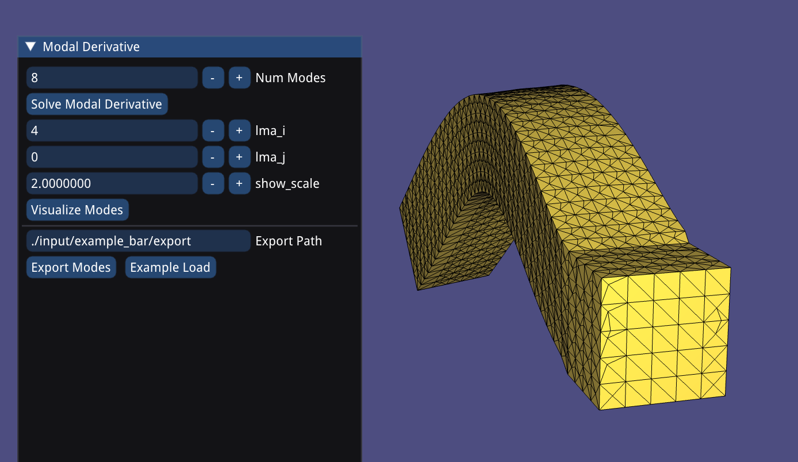
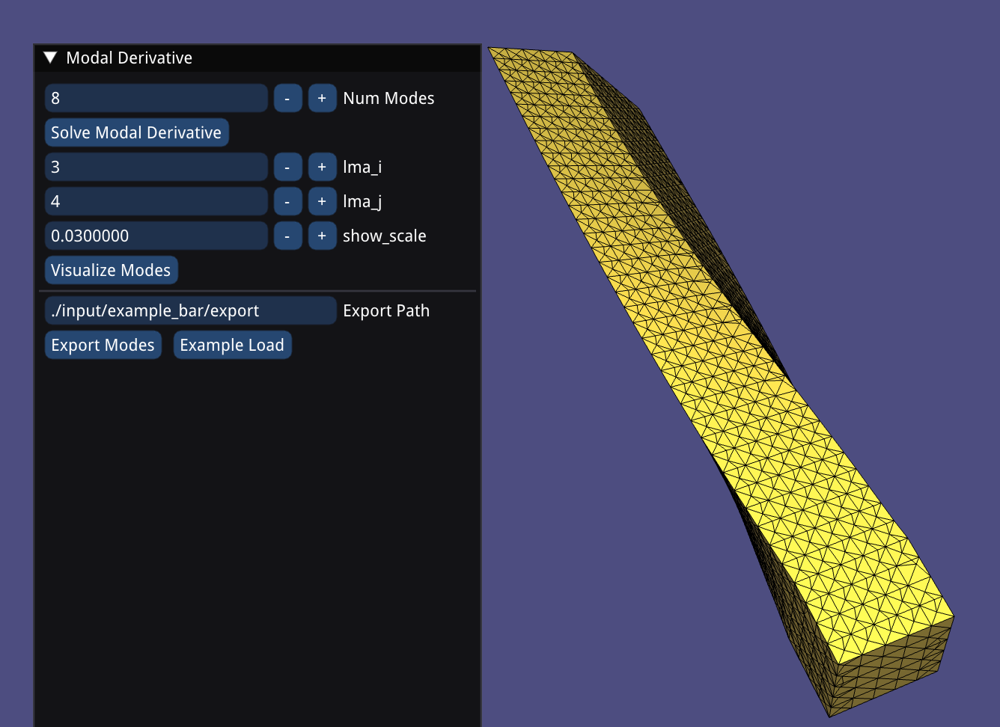

# LMA/MD example project

Simple implementation for LMA and MD.

## Compile

Compile this project using the standard cmake routine:

    mkdir build
    cd build
    cmake ..
    make

This should find and build the dependencies and create a `example_bin` binary.

## Run

Execute
```
./build/example_bin ./input/example_bar
```
and hopefully, you will see a GUI based on igl and ImGui.

For other materials:
```
./build/example_bin ./input/example_bar --materialType NeoHookean --youngsModulus 4000 --possionRatio 0.35 --density 25.0
```

Only StVK and NeoHookean materials are implemented in this example.
By default, we use StVK with Youngs Modulus 5000, Possion Ratio 0.4 and density 20.


## Example




To export, click "Export Modes" button.